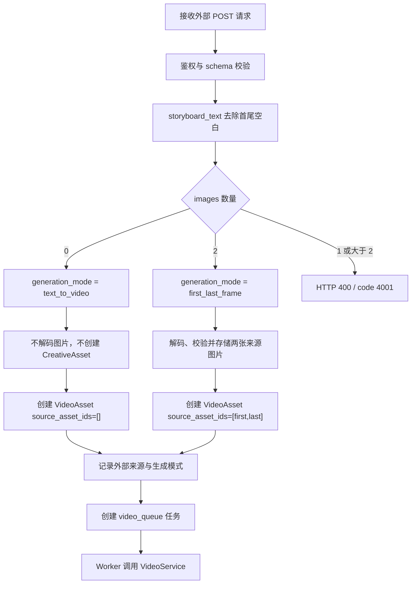

# 外部视频接口纯文本生视频模式设计

## 状态

已批准的产品与技术设计。

本文档定义现有外部视频生成接口新增“纯文本生视频”模式的正式契约与实现边界，不包含代码实现。后续实现必须先基于本文档编写实施计划。

## 背景

外部投放系统当前通过 AI 系统的现有接口创建视频任务：

```http
POST /api/v1/integrations/video-generation/videos
```

当前接口虽然在 schema 中允许 `images` 缺省并默认成空数组，但业务服务强制要求正好两张图片，因此实际上只支持“首帧 + 尾帧”生视频：

```text
images[0] = first_frame
images[1] = last_frame
```

视频 Worker 还曾对提示词追加 AI 后台的安全改写、Creative Safety、固定 3A 节奏、风格包与创意策略。现有外部提示词透传设计已经批准并部署后，外部来源任务应直接使用：

```python
prompt = (video.prompt or "").strip()
```

本次设计在此基础上，使受现有全局 Token 保护的同一外部接口同时支持：

1. 不上传图片时的纯文本生视频；
2. 上传两张图片时的首尾帧生视频。

## 目标

外部系统继续调用同一个接口，由 AI 后台仅根据 `images` 数量自动判断生成模式：

```text
images 缺省或 images=[]
  -> text_to_video
  -> storyboard_text 原样作为供应商文本提示词
  -> 不创建来源图片资产

images 正好 2 张
  -> first_last_frame
  -> 维持现有首尾帧生成流程
  -> storyboard_text 原样作为供应商文本提示词
```

外部系统不需要新增 `generation_mode` 字段，也不需要修改鉴权、轮询或响应解析逻辑。

## 非目标

- 不新增外部接口。
- 不新增公开的 `generation_mode`、`prompt_mode` 或 `passthrough` 请求字段。
- 不修改现有轮询接口或响应 schema。
- 不支持单图生视频。
- 不支持三张及以上参考图。
- 不把首尾帧请求失败后静默降级成纯文本请求。
- 不改变 AI 系统内部视频任务必须具备来源图片的默认规则。
- 不新增或更换鉴权 Token。
- 不增加来源 IP 白名单。
- 不修改外部投放系统 `/www/wwwroot/pixel_project`。
- 不新增安全拦截、3A 规则、风格包或 `creative_strategy`。
- 不尝试关闭、绕过或修改视频供应商自身的内容审核、风控或模型能力限制。
- 不修改模型、分辨率、音频、水印、优先级、超时等服务器控制参数。
- 不新增数据库字段或数据库迁移。
- 不修改 Nginx、前端或 `.env.production`。

## 已批准方案：根据 `images` 数量自动推断模式

### 模式判定表

| `images` 输入 | 内部模式 | 处理结果 |
|---|---|---|
| 字段缺省 | `text_to_video` | 接受，按纯文本生视频创建任务 |
| `[]` | `text_to_video` | 接受，按纯文本生视频创建任务 |
| 正好 2 张图片 | `first_last_frame` | 接受，维持现有首尾帧流程 |
| 正好 1 张图片 | 无 | HTTP 400，业务码 `4001` |
| 超过 2 张图片 | 无 | HTTP 400，业务码 `4001` |
| `null` | 无 | HTTP 400，业务码 `4001`，schema 校验失败 |

服务层必须以一个明确的模式判定函数或等价的单一分支实现以上规则，禁止在后续步骤中根据“图片读取失败”“供应商拒绝图片”或“图片数量异常”重新猜测模式。

建议的业务错误信息：

```text
images must be omitted, empty, or contain exactly 2 base64 images
```

### 为什么不公开 `generation_mode`

公开模式字段会让外部调用方同时维护“字段值”和“图片数量”两个事实，并引入冲突组合，例如：

```json
{
  "generation_mode": "text_to_video",
  "images": ["<first>", "<last>"]
}
```

本设计让 `images` 成为唯一判定依据，保持现有请求结构，并避免响应端新增字段影响严格解析的外部消费者。

## 公共接口契约

### 地址与鉴权

继续使用：

```http
POST /api/v1/integrations/video-generation/videos
Authorization: Bearer <AI_ADS_ACCESS_TOKEN>
Content-Type: application/json
```

轮询继续使用：

```http
GET /api/v1/integrations/video-generation/jobs/{job_id}
Authorization: Bearer <AI_ADS_ACCESS_TOKEN>
```

本设计复用现有全局 `AI_ADS_ACCESS_TOKEN`。任何能够通过该鉴权并访问现有外部视频接口的调用方，都属于本接口的受信任调用方并获得两种模式能力；不再增加第二套 Token、调用方字段或来源 IP 限制。

### 纯文本生视频请求示例

推荐省略 `images`：

```json
{
  "external_request_id": "video-text-20260722-000001",
  "storyboard_text": "Garuda guardian emerges from divine golden light, raises a legendary holy sword, flies above a giant purple crystal, strikes it into gold coins and purple shards, then freezes behind a huge golden reward number. Cinematic fantasy, vertical mobile game advertisement.",
  "duration_seconds": 12,
  "aspect_ratio": "9:16"
}
```

也允许明确传空数组：

```json
{
  "external_request_id": "video-text-20260722-000002",
  "images": [],
  "storyboard_text": "Create a 12-second vertical cinematic fantasy advertisement.",
  "duration_seconds": 12,
  "aspect_ratio": "9:16"
}
```

### 首尾帧生视频请求示例

现有调用方式保持不变：

```json
{
  "external_request_id": "video-frames-20260722-000001",
  "images": [
    "data:image/jpeg;base64,<first-frame>",
    "data:image/jpeg;base64,<last-frame>"
  ],
  "storyboard_text": "Continue naturally from the first frame and resolve exactly into the last frame.",
  "duration_seconds": 12,
  "aspect_ratio": "9:16"
}
```

图片顺序仍然是：

```text
images[0] = first_frame
images[1] = last_frame
```

### 创建响应

两种模式都继续返回现有 HTTP 202 envelope，不增加模式字段：

```json
{
  "code": 1001,
  "message": "processing",
  "data": {
    "job_id": "<video-job-id>",
    "status": "processing",
    "duration_seconds": 12,
    "aspect_ratio": "9:16"
  }
}
```

### 轮询响应

处理中：

```json
{
  "code": 1001,
  "message": "processing",
  "data": {
    "job_id": "<video-job-id>",
    "status": "processing",
    "duration_seconds": 12,
    "aspect_ratio": "9:16"
  }
}
```

成功：

```json
{
  "code": 0,
  "message": "success",
  "data": {
    "job_id": "<video-job-id>",
    "status": "succeeded",
    "duration_seconds": 12,
    "aspect_ratio": "9:16",
    "url": "https://ai.example.test/storage/videos/<video>.mp4"
  }
}
```

失败：

```json
{
  "code": 5001,
  "message": "video generation failed",
  "data": {
    "job_id": "<video-job-id>",
    "status": "failed",
    "duration_seconds": 12,
    "aspect_ratio": "9:16",
    "error": "<provider-or-transfer-error>"
  }
}
```

## 服务端创建流程



### `storyboard_text` 处理

两种模式都沿用外部提示词透传规则：

```python
storyboard_text = payload.storyboard_text.strip()
```

创建后：

```python
video.prompt = storyboard_text
```

Worker 向供应商构造请求时：

```python
prompt = (video.prompt or "").strip()
```

除去首尾空白是必要的技术校验，不属于创意改写。外部任务不得调用或间接应用：

```python
sanitize_creative_safety_text(...)
creative_safety_prompt_block()
_keyframe_brand_aaa_video_rules()
_creative_strategy_prompt_block(...)
```

也不得追加或改写：

- Creative Safety 规则；
- 赌博、金币、奖励、提现等词语替换；
- 固定品牌展示规则；
- 固定 `0-3s / 3-9s / 9-12s` 节奏；
- 3A 游戏广告风格；
- `style_pack`、`country_style_pack` 或 `market_game_style_pack`；
- `creative_strategy`；
- CTA、Boss、VIP、VFX 或国家市场规则。

供应商自己的审核与模型限制仍然生效，AI 后台不得把“提示词透传”描述成“保证供应商接受任何内容”。

### 纯文本模式的数据持久化

纯文本模式仍创建现有的临时 `Campaign`、`ContentTopic`、`CopyDraft`、`VideoAsset` 和 `GenerationTask`，但不创建来源 `CreativeAsset`。

`VideoAsset` 的关键字段：

```python
VideoAsset(
    source_asset_ids=[],
    prompt=storyboard_text,
    duration_seconds=payload.duration_seconds,
    aspect_ratio=payload.aspect_ratio,
    metadata_json={
        "source": "external_video_generation",
        "generation_mode": "text_to_video",
        # 保留现有 external_request_id 等追踪字段
    },
)
```

首尾帧模式继续创建两张来源 `CreativeAsset`，并记录：

```json
{
  "source": "external_video_generation",
  "generation_mode": "first_last_frame"
}
```

`GenerationTask.metadata_json` 同步记录相同的 `source` 和 `generation_mode`，用于日志、排障和任务追踪。真正决定 Worker 是否允许无图片启动的安全边界必须读取 `VideoAsset.metadata_json`，不能只依赖队列 payload 或任务 metadata。

### 外部专用“无来源图片”闸门

当前共享 `VideoService` 对所有无来源图片任务报错：

```text
Video task has no source images.
```

本设计只允许同时满足以下条件的视频绕过该错误：

```python
metadata.get("source") == "external_video_generation"
and metadata.get("generation_mode") == "text_to_video"
```

等价的行为规则：

| 视频来源 | `generation_mode` | 来源图片数量 | 结果 |
|---|---|---:|---|
| 外部视频接口 | `text_to_video` | 0 | 允许，向供应商提交纯文本请求 |
| 外部视频接口 | `first_last_frame` | 2 | 允许，提交首尾帧请求 |
| 外部视频接口 | 缺失或未知 | 0 | 拒绝 |
| AI 内部任务 | 任意或缺失 | 0 | 拒绝，保留原错误 |
| 任意任务 | 任意 | 1 | 不作为纯文本模式处理 |

禁止仅根据以下条件放行：

- `source_asset_ids` 为空；
- 没有 `creative_strategy`；
- prompt 非空；
- task type 看起来像视频任务；
- 供应商适配器能够接受空图片列表。

这个双标记闸门保证本次能力不会意外改变 AI 后台内部工作流。

## 供应商请求

当前火山引擎适配器先创建文本 content，再附加图片 content：

```python
content = [{"type": "text", "text": request.prompt}]
content.extend(self._image_content_items(request.source_images))
```

因此空 `source_images` 可以自然形成文本-only payload。火山引擎官方 Seedance 文档也将文本生视频描述为仅传文本内容，将图生视频描述为文本加图片内容；本设计不需要新增供应商接口或模型路由。

参考文档：<https://www.volcengine.com/docs/82379/1520758>

### 纯文本模式供应商 payload

```json
{
  "model": "<server-controlled model>",
  "content": [
    {
      "type": "text",
      "text": "<storyboard_text.strip()>"
    }
  ],
  "resolution": "<server-controlled resolution>",
  "ratio": "9:16",
  "duration": 12,
  "generate_audio": "<server-controlled boolean>",
  "watermark": "<server-controlled boolean>",
  "return_last_frame": "<server-controlled boolean>",
  "execution_expires_after": "<server-controlled integer>",
  "priority": "<server-controlled integer>"
}
```

必须验证：

```text
len(content) == 1
content[0].type == "text"
content[0].text == storyboard_text.strip()
```

### 首尾帧模式供应商 payload

```json
{
  "model": "<server-controlled model>",
  "content": [
    {"type": "text", "text": "<storyboard_text.strip()>"},
    {"type": "image_url", "role": "first_frame", "image_url": {"url": "<first>"}},
    {"type": "image_url", "role": "last_frame", "image_url": {"url": "<last>"}}
  ],
  "resolution": "<server-controlled resolution>",
  "ratio": "9:16",
  "duration": 12
}
```

现有其他服务器控制字段继续保留。

### 禁止静默降级

以下任何失败都必须按原模式失败并记录错误：

- 两张图片中的任一张 Base64/Data URL 无效；
- 图片超过配置大小限制；
- 图片存储失败；
- 首帧或尾帧 URL 无法解析；
- 供应商拒绝首尾帧参数；
- 供应商首尾帧任务超时或失败。

禁止执行：

```text
first_last_frame 失败
  -> 删除 source_images
  -> 以相同任务重新提交 text_to_video
```

如果调用方希望从首尾帧模式改成纯文本模式，必须新建请求，并使用新的 `external_request_id`。

## 幂等规则

现有 `external_request_id` 幂等语义保持不变：

1. 首次请求创建视频记录和生成任务；
2. 相同 `external_request_id` 再次请求时返回已有任务，或按现有安全重排队规则处理可重试失败；
3. 不因后续请求中的 `images`、`storyboard_text`、时长或比例不同而修改已有任务；
4. 不允许同一个 `external_request_id` 从 `first_last_frame` 切换为 `text_to_video`，或反向切换；
5. 调用方要改变生成模式或业务内容，必须生成新的 `external_request_id`。

响应中不增加 `generation_mode`。排障时通过内部 `VideoAsset.metadata_json`、`GenerationTask.metadata_json` 和脱敏日志确认实际模式。

## 校验与错误处理

### 请求级错误

请求 schema 或业务规则错误继续返回：

```http
HTTP/1.1 400 Bad Request
```

```json
{
  "code": 4001,
  "message": "<validation message>",
  "data": {}
}
```

`images: null` 属于 schema 校验错误，继续返回现有统一结构：

```json
{
  "code": 4001,
  "message": "request validation failed",
  "data": {
    "errors": ["<pydantic error details>"]
  }
}
```

### 供应商和异步失败

已经创建任务后的供应商失败继续通过轮询结果表达：

```json
{
  "code": 5001,
  "message": "video generation failed",
  "data": {
    "job_id": "<video-job-id>",
    "status": "failed",
    "error": "<normalized error>"
  }
}
```

两种模式继续复用现有超时、重试、状态刷新、视频下载和本地转存逻辑。

## 影响文件

预计实施只涉及以下范围：

### 必须修改

- `backend/app/services/external_video_generation_service.py`
  - 根据 `images` 数量推断模式；
  - 纯文本模式跳过图片解码、大小检查和来源资产创建；
  - 写入 `generation_mode`；
  - 创建 `source_asset_ids=[]` 的外部视频记录。

- `backend/app/services/video_service.py`
  - 仅对明确标记的外部 `text_to_video` 任务放行空来源图片；
  - 保持外部 raw prompt passthrough；
  - 保持内部无来源图片任务失败。

- `tests/test_external_video_generation.py`
  - 增加接口、持久化、任务、Worker、幂等、错误和回归测试。

- `tests/test_video_provider.py`
  - 增加火山引擎文本-only payload 测试；
  - 保留首尾帧 payload 回归测试。

### 可能无需修改，但必须核对

- `backend/app/schemas/external_video_generation.py`
  - 当前 `images: list[str] = Field(default_factory=list)` 已支持字段缺省和空数组；
  - 必须保留 `extra="forbid"`；
  - 不增加公开模式字段。

- `backend/app/integrations/video/volcengine_provider.py`
  - 当前 payload 构造已允许零张图片并生成仅文本 content；
  - 若测试通过，不为本功能增加额外分支；
  - 不改变两图角色映射、最大图片数、时长和其他供应商参数校验。

### 不修改

- 外部投放系统 `/www/wwwroot/pixel_project`；
- 外部视频 API 路由地址；
- 轮询响应 schema；
- 前端；
- Nginx；
- 数据库模型和迁移；
- `.env.production`；
- 鉴权依赖和 `AI_ADS_ACCESS_TOKEN`。

## 测试设计

### 1. 请求与模式判定

必须覆盖：

- `images` 缺省时创建 `text_to_video`；
- `images=[]` 时创建 `text_to_video`；
- 两张图片时创建 `first_last_frame`；
- 一张图片返回 HTTP 400 / `code=4001`；
- 三张图片返回 HTTP 400 / `code=4001`；
- `images=null` 返回 HTTP 400 / `code=4001` schema 错误；
- `storyboard_text` 为空白时继续失败；
- 未知字段继续被 `extra="forbid"` 拒绝；
- 未携带有效 `AI_ADS_ACCESS_TOKEN` 时继续被鉴权拒绝。

### 2. 持久化与任务创建

纯文本模式必须断言：

- 不创建来源 `CreativeAsset`；
- `VideoAsset.source_asset_ids == []`；
- `VideoAsset.prompt == storyboard_text.strip()`；
- `VideoAsset.metadata_json.source == "external_video_generation"`；
- `VideoAsset.metadata_json.generation_mode == "text_to_video"`；
- `GenerationTask` 位于 `video_queue`；
- `GenerationTask.metadata_json.generation_mode == "text_to_video"`。

首尾帧模式必须断言：

- 仍创建两张来源 `CreativeAsset`；
- 角色顺序仍为 `first_frame`、`last_frame`；
- `generation_mode == "first_last_frame"`；
- 现有图片存储和大小限制继续生效。

### 3. Worker 与服务边界

必须覆盖：

- 明确标记的外部 `text_to_video` + 0 图片能够启动供应商任务；
- 外部 `text_to_video` 的供应商 request 中 `source_images == []`；
- 外部 `text_to_video` 的 prompt 精确等于 `storyboard_text.strip()`；
- 外部 `first_last_frame` 仍带两张图片；
- 外部来源但缺失 `generation_mode` 且 0 图片时失败；
- 外部来源但模式未知且 0 图片时失败；
- 内部任务 0 图片时仍报 `Video task has no source images.`；
- 内部任务原有提示词增强和最终文字覆盖行为不变。

### 4. 供应商 payload

必须覆盖：

- 纯文本模式 `content` 只有一个文本项；
- 文本项内容精确等于透传 prompt；
- 纯文本模式不出现 `image_url`；
- 首尾帧模式仍生成 `text + first_frame + last_frame`；
- 1、3 或更多图片不会通过外部服务到达供应商；
- 时长、比例、分辨率、音频、水印等字段继续由服务器控制。

### 5. 幂等与无降级

必须覆盖：

- 相同 `external_request_id` 的纯文本重试复用原任务；
- 相同 `external_request_id` 的首尾帧重试复用原任务；
- 相同 ID 后续改传另一种模式不会修改已有任务；
- 两图解码或供应商失败时不会创建第二个纯文本供应商任务；
- 使用新的 `external_request_id` 可以创建另一种模式的新任务。

### 6. 响应兼容性

必须覆盖：

- 创建继续返回 HTTP 202 / `code=1001`；
- 处理中、成功和失败 envelope 结构不变；
- 成功继续通过 `data.url` 返回视频地址；
- 响应中不存在 `generation_mode`；
- 轮询地址和鉴权方式不变。

## 验收标准

实现完成必须同时满足：

1. 外部系统省略 `images` 或发送 `images=[]` 时能创建纯文本视频任务；
2. 外部系统发送正好两张图片时保持现有首尾帧行为；
3. 1 张或超过 2 张图片被明确拒绝，不被当成纯文本模式；
4. 纯文本模式不创建来源图片资产，`source_asset_ids=[]`；
5. 只有 `source=external_video_generation` 且 `generation_mode=text_to_video` 的任务能够无图片启动；
6. AI 内部无图片视频任务继续失败；
7. 两种外部模式的供应商 prompt 都精确等于 `storyboard_text.strip()`；
8. AI 后台不追加安全规则、3A 规则、风格包或 `creative_strategy`；
9. 供应商自身审核和模型限制仍然生效；
10. 首尾帧失败不会静默降级为纯文本生视频；
11. 相同 `external_request_id` 保持原任务和原模式；切换模式必须使用新 ID；
12. 创建、轮询、成功和失败响应 schema 均不新增 `generation_mode`；
13. 无数据库迁移、前端、Nginx、`.env.production` 或外部系统改动；
14. 没有提交 `.env`、`.env.production`、`AGENTS.md`、Token、API Key 或无关文件。

## 部署与运行影响

代码实施通过测试后，需要在测试服务器重新构建并启动：

- FastAPI Backend；
- Video Celery Worker。

仅重启 Backend 不足以让 Worker 中新的无图片闸门与供应商请求逻辑生效。

部署阶段应：

1. 确认代码提交与公司 `team/main` 对齐；
2. 检查服务器工作区，不能因未跟踪的 `.env.production.bak.*` 直接执行会覆盖文件的操作；
3. 备份服务器 `.env.production`，但不修改、不提交；
4. 重建 `backend` 和 `worker_video`；
5. 分别验证容器状态、健康接口和外部 API 鉴权；
6. 先用测试桩验证纯文本供应商 payload；
7. 再分别回归纯文本和首尾帧任务；
8. 验证轮询、视频转存和最终 URL。

本设计不要求重建外部投放系统。

## 真实供应商调用边界

单元测试、接口测试和 mock provider 测试不产生真实视频费用，可以作为实现验收的一部分执行。

真实火山引擎纯文本生视频 smoke test 会消耗供应商额度。除非用户再次明确授权“可以进行一次真实付费视频生成测试”，否则实施与部署阶段只能验证：

- 配置存在但不输出密钥；
- provider payload 结构正确；
- 队列、Worker 与状态链路正常；
- mock/stub 测试通过。

不得把未执行真实供应商调用描述为“真实模型生成已验证成功”。

## 回滚

本功能没有数据库迁移。回滚 Backend 与 Video Worker 到上一版本即可恢复旧行为：外部接口再次只接受两张图片，所有无来源图片的视频任务再次失败。

回滚不会改变已经提交给供应商的任务，也不会自动取消或重新生成已存在的视频。

## 实施前约束

- 本文档获用户书面复核后，下一步只编写实施计划；
- 实施必须先补充失败测试，再修改生产代码；
- 不修改主工作区中的无关脏文件；
- 不提交 `.env`、`.env.production`、`AGENTS.md`、凭据或服务器备份；
- 未获得新的明确授权前，不推送公司仓库、不合并 `team/main`、不修改测试服务器，也不执行真实付费视频生成。