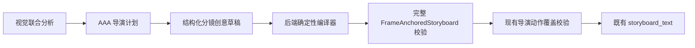

# Storyboard V2 确定性编译器设计

**日期：** 2026-07-23

## 背景

Storyboard V2 当前让最终一次大模型调用同时承担导演创意、时间线、首尾锚点、内部 claim ID、阶段证据、枚举和最终业务校验。严格结构化输出只覆盖导演计划，最终分镜仍先进入完整 `FrameAnchoredStoryboard` 校验；当模型输出自然语言 claim ID、空证据数组或 `final_lock` 等导演阶段词时，会在后端规范化之前失败。

## 目标

- 保留大模型对动作、镜头、特效、高潮和连续镜头调度的创意控制。
- 将内部记账字段改由后端确定性生成。
- 正常流程仍然只有分析、导演计划、分镜草稿三次模型调用。
- 外部异步接口、轮询方式和 `storyboard_text` 返回字段不变。
- 不增加第二次大模型审稿或修复调用。

## 架构

## 模型草稿边界

草稿保留：场景时间建议、画面、动作、镜头、特效、声音、高潮提示、首尾回归指令、overlay 指令、导演 beat 关联、signature/source 关联、阶段标签和执行动作。

草稿不包含：

- `claim_id`
- 完整 `phase_evidence`
- 最终权威 `tension_stage` 枚举

最终请求使用 `FrameAnchoredStoryboardDraft` 严格 JSON Schema。草稿的 `frame_anchor` 和 `tension_stage_hint` 使用开放字符串，让编译器吸收 `opening`、`final_lock` 等导演表达，而不是让模型请求直接失败。

## 编译器职责

1. 以导演计划、行为图为合法 moment/source/beat 白名单。
2. 清理空白、重复 ID；未知 ID 不进入最终覆盖证据，并写脱敏诊断日志。
3. 按 scene 顺序重新编号，规范连续时间边界，固定首场从 0 秒开始、末场在目标时长结束。
4. 强制首场 `first_frame`、中间 `transition`、末场 `last_frame`。
5. 根据导演高潮 beat、action arc 窗口和场景位置生成合法 `tension_stage`。
6. 按合法 moment/source 绑定和阶段标签生成 `phase_evidence`；任一侧为空时不生成伪证据。
7. 按执行者、断言、动作文本、moment/source 绑定稳定生成 `__sbv2_claim_NNN__`；相同动作绑定复用，不同动作不共用。
8. 不改写模型的画面、动作、镜头、特效和声音创意文本。
9. 生成完整 `FrameAnchoredStoryboard` 后继续执行现有导演覆盖和动作因果校验。

## 失败边界

- 草稿缺少至少两个可编译场景、无法形成正时长时间线时，编译器明确失败。
- 未知 ID 会被过滤并记录诊断，不能伪造覆盖；如果因此缺失核心动作，现有覆盖校验继续阻止任务成功。
- 编译器不凭空创造新的核心动作或视觉结果。

## 兼容性

- 外部创建和轮询接口不变。
- 返回结果继续提供既有 `storyboard_text`、`duration_seconds`、`aspect_ratio`。
- 私有 metadata 可继续保存候选草稿和最终编译结果，但不会把私有 ID 暴露到公开文本。
