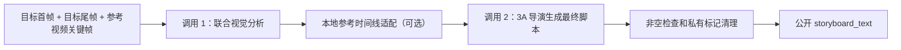

# Storyboard V2 两次模型调用导演脚本设计

**日期：** 2026-07-23

## 背景

Storyboard V2 当前正常路径包含三次大模型调用：联合视觉分析、独立导演计划、结构化分镜草稿。随后后端还会进行确定性编译、动作覆盖、高潮阶段、回归末帧和内部证据 ID 校验。该链路把创意判断拆成了多层硬契约，增加调用耗时，也会因为 `return`、动作覆盖或内部 ID 不满足后端规则而拒绝一段本可直接用于视频生成的脚本。

## 目标

- 正常路径只调用两次大模型。
- 第一次联合分析目标首帧、目标尾帧和参考视频关键帧。
- 第二次让模型以 3A 商业视频导演身份直接生成最终 `storyboard_text`。
- 不再要求或校验动作覆盖、固定高潮阶段、`return` / `final_lock`、signature/source ID、execution/phase evidence 或语义质量评分。
- 外部创建接口、异步 Redis/Celery 队列、轮询接口和公开字段保持不变。
- 不增加语义审稿或修复模型调用；网络、上游错误、非法 JSON、空输出仍按技术失败处理。

## 新调用链



参考视频抽帧、时间线适配和分析缓存都是本地处理，不增加模型调用次数。

## 最终输出契约

第二次调用继续使用结构化输出以保证程序稳定取值，但结构仅包含：

```json
{
  "storyboard_text": "可直接传给视频生成模型的完整脚本"
}
```

结构化输出只负责确保根字段存在，不规定场景数组、固定时间段、阶段枚举、内部证据关系或评分字段。`storyboard_text` 去除首尾空白后必须非空。

## 导演提示词原则

第二次调用应：

1. 把目标首帧和目标尾帧当作开场与结尾视觉身份的最高优先级事实。
2. 把参考视频分析中的人物出现方式、动作因果、运镜、节奏、VFX、UI、文字、奖励反馈和视觉元素生命周期作为创作素材。
3. 允许导演根据目标素材与目标时长自由保留、改编、替换或省略参考元素，不要求输出证明 ID。
4. 生成一条连续、可直接交给视频模型的完整导演脚本，不要求后期剪辑或多段拼接。
5. 保留现有广告合规、安全限制和 3A 商业表现力要求，但不套用固定 0-3s / 3-9s / 9-12s 模板；节奏随目标时长和参考行为动态组织。
6. 不泄露 `__sbv2_*__` 等内部分析标记。

## 服务层行为

服务层只负责：

1. 读取缓存分析，或执行联合视觉分析。
2. 若有参考视频分析，保留本地 `adapt_reference_behavior_timeline()` 结果。
3. 调用 `generate_frame_anchored_video_storyboard_text()`。
4. 去除脚本首尾空白并清理内部 `__sbv2_*__` 标记。
5. 空脚本抛出明确 `ProviderError`。
6. 返回原有 `request_id`、`storyboard_text`、`duration_seconds`、`aspect_ratio`。

服务层不再调用独立导演计划、确定性编译器、动作覆盖审查或最终动作覆盖校验。

## 兼容性与保留代码

- 外部 API 请求字段不变。
- 任务仍进入既有文本队列，由 Celery Worker 异步执行并通过原 jobs 接口轮询。
- 私有 metadata 继续保存 `frame_analysis`，并可保存最终文本候选用于排障。
- 旧导演计划、编译器和校验器可暂时保留给历史测试或其他内部用途，但 Storyboard V2 生产路径不再调用。
