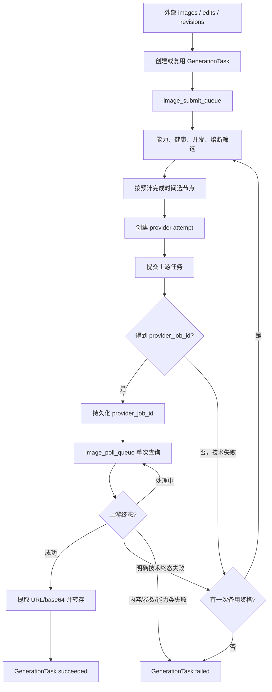

# 外部异步生图多上游路由设计

## 状态

已完成设计确认，尚未实施代码。

本文档只定义外部系统异步生图接口的多上游路由能力。后续实现必须先基于本文档编写实施计划；在计划、测试和审阅完成前，不改动外部系统接口契约，也不启用新的上游配置。

## 1. 背景与目标

当前外部生图实现主要假设上游在一次调用内直接返回图片 URL 或 base64。随着 CPA 内多个生图模型、Volcengine 和其他中转站接入，需要将所有外部生图统一为异步生命周期：

```text
提交任务 → 获得上游任务 ID → 后台轮询 → 取得图片 → 我方转存 → 外部查询我方任务
```

目标是：

- 后台按**速度优先**在多个模型/上游节点中自动路由；
- 提交前或明确技术性终态失败时，最多自动换一次下一个最快节点；
- 外部系统保持现有请求、鉴权、返回和用我方 `job_id` 查询的规则；
- 支持 CPA、Volcengine 和未来普通 HTTP JSON 异步上游；
- 轮询不长期占住提交生图的 worker。

## 2. 范围与非目标

### 2.1 范围

本设计仅覆盖外部异步生图接口：

```http
POST /api/v1/integrations/image-generation/images
POST /api/v1/integrations/image-generation/edits
POST /api/v1/integrations/image-generation/jobs/{source_job_id}/revisions
GET  /api/v1/integrations/image-generation/jobs/{job_id}
```

前三个创建接口都必须进入新路由层。还包括：节点健康度、并发、熔断、耗时统计、单次技术性备用、上游尝试记录、适配器契约和 `.env.production` 配置。

### 2.2 非目标

本期不包含：

- 管理端、内部工单或同步生图流程改造；
- 更改外部请求、响应、鉴权或查询接口；
- 让外部调用方指定真实供应商或模型；
- 配置后台页面、配置管理 API 或数据库化配置；
- 已取得上游任务 ID 后因轮询慢而自动并行/复制提交；
- 把 OAuth、复杂签名、回调、多阶段私有协议塞进通用 HTTP 适配器。

## 3. 对外兼容契约

### 3.1 外部系统零改动

外部系统继续提交现有请求，创建成功后仅保存我方 `job_id`，并继续轮询：

```http
GET /api/v1/integrations/image-generation/jobs/{job_id}
```

对外不暴露真实供应商、真实模型、内部路由节点、`provider_job_id`、原始上游响应或备用路径。

### 3.2 `model_id` 兼容但忽略

如请求传入 `model_id`：

1. 继续接受该字段，保证兼容；
2. 不以其筛选、排序或选择节点；
3. 不将它转发给任一上游；
4. 实际模型仅由内部路由节点的 `internal_model_id` 决定；
5. 对外响应不回显实际选择。

因此，`model_id` 在此接口中只是兼容性输入，不是执行控制参数。

### 3.3 状态与幂等

现有 `GenerationTask` 继续是外部唯一任务实体和唯一 `job_id`：

```text
queued     已受理，等待路由或提交
running    正在提交或轮询上游
succeeded  图片已取得并完成我方转存
failed     无可继续的合格尝试
```

已有 `external_request_id` 继续作为外部幂等边界。重复请求命中既有任务时，不重新选路、不重新提交、不新增上游 attempt，而是返回既有任务。

## 4. 路由节点

选择和度量单位不是单纯供应商，而是：

```text
供应商通道 + 内部模型 + 能力配置
```

例如：

```text
CPA / gpt-image-2
CPA / Gemini 生图模型
CPA / 其他 CPA 生图模型
Volcengine / Seedream
Relay A / Model X
Relay B / Model Y
```

即便多个节点共享 CPA，也分别度量速度、限流、错误率、并发和熔断；同时可配置通道组，以便 CPA 整体网络或账号池异常时整体降级。

每个节点最少包含：

```text
node_id
adapter_type              cpa_async / volcengine_async / http_async
internal_model_id
capabilities              generate、edit、revision
enabled
concurrency_limit
channel_group             可选，如 CPA
adapter configuration
```

这些标识均为内部数据，不进入外部 API。

## 5. 统一异步状态机



### 5.1 能力映射

| 外部接口 | 需要的节点能力 | 说明 |
| --- | --- | --- |
| `/images` | `generate` | 文生图或既有生成语义 |
| `/edits` | `edit` | 以输入图片为基础编辑 |
| `/jobs/{source_job_id}/revisions` | `revision`，或显式支持 revision 的 `edit` | 基于我方任务修订 |

不具备所需能力的节点不进入候选，即使它看起来更快。

### 5.2 取得 `provider_job_id` 后的硬边界

一旦上游提交成功并获得 `provider_job_id`：

- 立即持久化；
- 必须继续轮询该任务直至成功、明确失败或命中该节点配置的终止条件；
- 不得仅因轮询慢向另一个上游重复提交；
- 不得并行多投，避免重复收费与重复出图。

因此第一期备用仅适用于：提交前技术失败，或上游明确技术性终态失败且确认没有可用结果。一个外部任务最多有两个上游 attempt。

轮询多久可视为超出节点等待上限由环境变量决定；第一期不硬编码具体秒数，也不默认把长轮询自动改投。

## 6. 速度优先路由

不额外调用 LLM 做路由，以避免增加延迟、费用和不确定性。路由规则是确定性的：

```text
能力筛选
→ enabled、健康、熔断和通道组筛选
→ 节点并发与在途上限检查
→ 预计完成时间排序
→ 选择最快的合格节点
```

### 6.1 预计完成时间如何预测

节点排序使用估计完成时间：

```text
预计排队等待 + 近期生成耗时 + 波动与错误惩罚
```

- **预计排队等待**：根据节点当前在途任务数、并发限制和近期同类任务服务时间估计；节点已满时不进候选。
- **近期生成耗时**：按节点、操作类型、图片数量和规格/比例分桶，优先使用近期成功 attempt 的 EWMA 与 P50。
- **波动与错误惩罚**：P90 相对 P50 的尾部延迟、429/5xx/超时比例和连续技术失败会增加惩罚。

推荐统计键：

```text
node_id + operation + image_count_bucket + size_or_ratio_bucket
```

例如单张 1:1 generate 与多张 9:16 edit 不混用样本。

### 6.2 冷启动、健康与熔断

新节点不能因没有样本而被当作最快。每个节点必须配置保守的：

```text
cold_start_estimated_seconds
```

且初始并发较低；达到最小成功样本数后，才逐步由实际 EWMA/P50 取代冷启动估计。

健康度至少基于：最近成功率、技术错误率、429/5xx 比例、连续技术失败、最近成功时间和熔断截止时间。节点状态：

```text
healthy     正常参与候选
degraded    可选，但有排序惩罚
open        熔断，不参与普通候选
half_open   少量探测；成功恢复，失败重开
```

内容审核、参数错误、能力不匹配、明确账号/业务拒绝不能算作可自动备用的技术故障。

## 7. 适配器契约

核心路由不依赖供应商字段形态，只依赖：

```text
submit(request) -> SubmissionResult
poll(provider_job_id, context) -> PollResult
cancel(provider_job_id, context) -> optional
```

```text
SubmissionResult
- accepted
- provider_job_id
- provider_status
- sanitized_response

PollResult
- state: pending | succeeded | failed
- result_images: URL 或 base64 列表
- retry_after_seconds: optional
- error_category: optional
- error_message: sanitized
- sanitized_response
```

适配器不得把密钥、完整请求头、未经净化的原始响应或上游内部错误直接写入日志、可读数据库字段或外部响应。

### 7.1 CPA

CPA 是通道，不是单一模型。GPT、Gemini 和其他 CPA 图像模型作为独立路由节点，可共享基础地址、鉴权、通道组熔断和通道级并发。

Gemini 经 CPA 接入，**不建立直连 Gemini 适配器**。如果 CPA 协议满足通用 submit/poll JSON 结构，可以使用 `http_async`；否则增加 `cpa_async` 专用适配器。

### 7.2 Volcengine

使用 `volcengine_async` 专用适配器处理其实际提交、查询、状态与结果字段。路由、attempt、幂等、备用、转存仍由通用编排层负责。

### 7.3 通用 HTTP JSON 异步适配器

`http_async` 仅适用于稳定的：

```text
POST 提交 JSON
→ 可提取 provider_job_id
→ GET 或 POST 轮询 JSON
→ 可映射任务状态与图片 URL/base64
```

可配置：提交/轮询 URL 和方法、受限请求模板、请求头、JSON 路径、状态映射、结果路径、间隔、超时、并发和技术错误码。

JSON 路径使用受限且无执行能力的语法：

```text
$.task.id
$.data.status
$.data.images[0].url
```

禁止在 `.env.production` 中执行脚本、任意表达式或模板代码。复杂签名、OAuth、回调或多阶段协议必须新增专用适配器。

## 8. 数据模型与审计

### 8.1 保留 GenerationTask

`GenerationTask` 继续保存外部唯一 `job_id`、外部幂等关联、公开状态和最终结果。不迁移历史任务，不改外部查询规则。

### 8.2 新增 attempt 表

建议新增：

```text
image_provider_attempts
```

一个 `GenerationTask` 对应一到两个 attempt，字段至少包括：

| 字段 | 用途 |
| --- | --- |
| `id` | attempt 主键 |
| `generation_task_id` | 我方任务 |
| `route_node_id` | 内部节点 |
| `adapter_type` | 实际适配器 |
| `internal_model_id` | 实际内部模型 |
| `attempt_sequence` | 1 为主、2 为唯一备用 |
| `provider_job_id` | 上游任务 ID |
| `status` | submitting、submitted、polling、succeeded、failed |
| `submitted_at`、`last_polled_at`、`finished_at`、`next_poll_at` | 生命周期时间 |
| `error_category` | technical、content_policy、validation、capability、account、unknown |
| `fallback_reason` | 备用原因 |
| `request_fingerprint` | 规范化输入摘要 |
| `sanitized_provider_response` | 脱敏诊断 |
| `created_at`、`updated_at` | 审计 |

关键约束：

- `(generation_task_id, attempt_sequence)` 唯一；
- 同一任务最多两个 attempt；
- 非空 `provider_job_id` 建索引；
- attempt 终态不可被后续 poll 覆盖；
- 原始响应仅保存白名单净化字段。

### 8.3 指标

attempt 终态或关键阶段写入可聚合指标：

```text
submit_latency_ms
queue_wait_ms
provider_generation_ms
end_to_end_ms
poll_count
http_status
error_category
route_node_id
operation
size_or_ratio_bucket
image_count_bucket
```

路由统计必须在 worker 重启后仍能恢复必要判断，不能只依赖易失的内存数据。

## 9. 队列与并发

将内部职责拆分：

```text
image_submit_queue
- 选节点、创建 attempt、提交、保存 provider_job_id、安排首次 poll

image_poll_queue
- 单次轮询一个 provider_job_id
- 保存状态
- 成功时转存并完成任务
- pending 时按 next_poll_at 延迟重投
- 失败时分类并决定是否受限备用
```

`image_poll_queue` 单次任务必须短小、幂等和可重入。重复消息基于 attempt 状态与 `provider_job_id` 防止重复转存、重复成功和重复备用。

并发有三层：worker 并发、节点并发、可选通道组并发。节点已满时选择下一个最快合格节点；没有合格节点时不盲目重投。

## 10. 自动备用与防重复收费

### 10.1 允许一次备用

以下技术性失败可以进入一次备用选择：

```text
网络、DNS、TLS、连接失败
提交超时且可确认未接受任务
HTTP 429
HTTP 5xx
上游明确的临时服务错误
上游明确技术性终态失败且无可用结果
```

备用排除已失败节点，按当前速度排序选择下一个最快合格节点，写入 `fallback_reason`。

### 10.2 禁止备用

以下情况不向另一上游重复提交：

```text
内容审核/安全拦截
参数、图片格式、尺寸错误
能力不匹配
明确的模型、账号、配额或业务权限不支持
上游业务规则拒绝
```

### 10.3 收费保护

- 一个我方任务最多两个上游提交；
- 一旦保存 `provider_job_id`，禁止自动复制提交；
- 提交超时但可能已接受时，优先使用上游幂等键或查询确认；
- 无法确认“未创建上游任务”时，默认不切备用，以避免重复计费；
- 上游请求带我方任务/attempt 的可追踪幂等标识，但不泄露敏感输入。

## 11. 环境变量契约

所有节点地址、模型、密钥、并发、路径和状态映射只在服务器私有 `.env.production` 中定义，修改后重新部署加载。不提供运行时后台管理 API/页面。

推荐使用节点清单加前缀：

```env
IMAGE_ROUTER_ENABLED=true
IMAGE_ROUTER_POLICY=speed
IMAGE_ROUTE_NODES=CPA_GPT,CPA_GEMINI,VOLCENGINE_SEEDREAM,RELAY_A
IMAGE_ROUTER_MAX_ATTEMPTS=2
IMAGE_ROUTER_DEFAULT_POLL_SECONDS=5
IMAGE_ROUTER_METRICS_WINDOW=100
IMAGE_ROUTER_CIRCUIT_FAILURE_THRESHOLD=3
IMAGE_ROUTER_CIRCUIT_OPEN_SECONDS=60

IMAGE_NODE_CPA_GPT_ENABLED=true
IMAGE_NODE_CPA_GPT_ADAPTER=cpa_async
IMAGE_NODE_CPA_GPT_CHANNEL_GROUP=CPA
IMAGE_NODE_CPA_GPT_MODEL=<internal-only-model-id>
IMAGE_NODE_CPA_GPT_CAPABILITIES=generate,edit,revision
IMAGE_NODE_CPA_GPT_CONCURRENCY=2
IMAGE_NODE_CPA_GPT_COLD_START_ESTIMATED_SECONDS=45
IMAGE_NODE_CPA_GPT_SUBMIT_TIMEOUT_SECONDS=20
IMAGE_NODE_CPA_GPT_POLL_TIMEOUT_SECONDS=15
IMAGE_NODE_CPA_GPT_MAX_POLL_WAIT_SECONDS=600

IMAGE_NODE_CPA_GEMINI_ENABLED=true
IMAGE_NODE_CPA_GEMINI_ADAPTER=http_async
IMAGE_NODE_CPA_GEMINI_CHANNEL_GROUP=CPA
IMAGE_NODE_CPA_GEMINI_MODEL=<internal-only-model-id>
IMAGE_NODE_CPA_GEMINI_CAPABILITIES=generate,edit,revision
IMAGE_NODE_CPA_GEMINI_CONCURRENCY=2
IMAGE_NODE_CPA_GEMINI_COLD_START_ESTIMATED_SECONDS=50
IMAGE_NODE_CPA_GEMINI_SUBMIT_URL=<private-submit-url>
IMAGE_NODE_CPA_GEMINI_POLL_URL_TEMPLATE=<private-poll-url-containing-provider-job-id>
IMAGE_NODE_CPA_GEMINI_SUBMIT_JOB_ID_PATH=$.task.id
IMAGE_NODE_CPA_GEMINI_POLL_STATUS_PATH=$.task.status
IMAGE_NODE_CPA_GEMINI_RESULT_URL_PATH=$.task.images[*].url
IMAGE_NODE_CPA_GEMINI_RESULT_BASE64_PATH=$.task.images[*].b64_json
IMAGE_NODE_CPA_GEMINI_STATUS_MAP=queued:pending,running:pending,succeeded:succeeded,failed:failed

IMAGE_NODE_VOLCENGINE_SEEDREAM_ENABLED=true
IMAGE_NODE_VOLCENGINE_SEEDREAM_ADAPTER=volcengine_async
IMAGE_NODE_VOLCENGINE_SEEDREAM_MODEL=<internal-only-model-id>
IMAGE_NODE_VOLCENGINE_SEEDREAM_CAPABILITIES=generate
IMAGE_NODE_VOLCENGINE_SEEDREAM_CONCURRENCY=2
IMAGE_NODE_VOLCENGINE_SEEDREAM_COLD_START_ESTIMATED_SECONDS=40
```

真实密钥示例只使用占位符，例如：

```env
IMAGE_NODE_RELAY_A_AUTHORIZATION=<private-secret>
```

启动校验必须拒绝重复节点名、未知适配器、空能力集、非法并发/超时、`http_async` 缺少必要 URL/路径/状态映射、无效 JSON 路径、未配置任何图片结果路径，以及路由开启但无启用节点等配置。不得静默回退到旧同步假设。

## 12. 迁移、发布与回滚

### 12.1 迁移

新增 `image_provider_attempts` 表与必要索引。历史 `GenerationTask` 不回填、不改写，部署后创建的新外部任务进入新链路。

紧急回滚时不删除 attempt 表或记录；旧应用不依赖新表即可保留它。

### 12.2 分阶段上线

1. 代码和迁移上线，`IMAGE_ROUTER_ENABLED=false`，验证启动、迁移和队列；
2. 仅启用一个节点，验证 images、edits、revisions、轮询与转存；
3. 增加多个节点，观察速度选择、P50/P90、错误分类和限流；
4. 确认上游幂等与错误分类后，打开一次技术性备用。

每阶段都要求外部系统不改请求或查询逻辑。

### 12.3 回滚

异常时在服务器私有 `.env.production` 设置：

```env
IMAGE_ROUTER_ENABLED=false
```

然后重新部署受影响服务。停止创建新路由任务，但已获得 `provider_job_id` 的任务应继续被轮询至终态或人工处置。不得删除任务、attempt 或已转存资产。

## 13. 测试与验收

### 13.1 单元测试

至少覆盖：能力筛选；健康、熔断、并发、通道组；速度排序；冷启动保守估计；`model_id` 不参与路由和上游请求；三种适配器映射；路径与配置校验；请求/响应/日志脱敏；外部幂等不重复提交。

### 13.2 任务测试

至少覆盖：

- 三种创建接口进入统一异步任务；
- submit 得到 `provider_job_id` 后由 poll 队列完成；
- pending 延迟重投而非占住 worker；
- URL 与 base64 成功转存；
- 429、5xx、网络失败和可确认的未创建提交超时触发一次备用；
- 审核、参数、能力、业务/账号拒绝不备用；
- 已保存 `provider_job_id` 不会自动第二次提交；
- 重复 poll、重复消息和 worker 重启不重复转存或备用；
- attempt 数永远不超过两次。

### 13.3 生产式本地 Docker 验证

必须验证 backend、submit worker、poll worker 加载同一 `.env.production`；外部创建与查询格式保持兼容；一条受控任务可完成提交、轮询、转存和查询成功；主节点技术失败仅备用一次；日志和数据库没有密钥、完整图片数据或原始上游响应；队列无长轮询堆积，节点并发不超过配置。

## 14. 验收标准

1. 外部系统无需改鉴权、请求、`model_id` 或按我方 `job_id` 轮询的规则；
2. 新外部生图任务统一使用“上游任务 ID + 后台轮询”生命周期；
3. images、edits、revisions 都经过同一能力筛选和路由器；
4. CPA 内不同模型、Volcengine 和后续 HTTP 中转站可作为独立节点接入；
5. 路由按速度优先，并考虑排队、近期耗时、波动、健康、并发与熔断；
6. 外部不看到供应商、内部模型、`provider_job_id` 或备用细节；
7. 仅技术性失败自动备用一次，获得 `provider_job_id` 后不重复提交；
8. 所有私有配置在 `.env.production`，改配置后重新部署加载；
9. 无效配置有明确脱敏诊断，不静默回退；
10. 迁移、队列、测试、灰度和回滚均可验证，内部同步生图流程不在改造范围内。
