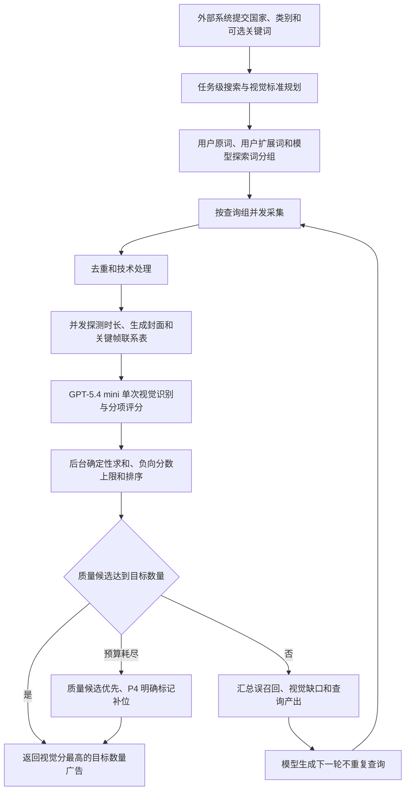

# 广告研究用户关键词优先与视觉质量修复设计

**日期：** 2026-07-24
**状态：** 已完成方案讨论，等待书面设计审阅
**基线：** `team/main`，设计编写时提交 `a6ead85`
**关联设计：**

- `docs/superpowers/specs/2026-07-23-广告研究视觉评分重构设计.md`
- `docs/superpowers/specs/2026-07-23-广告研究关键词闭环与视觉质量补采优化设计.md`

本文是对上述设计的增量修订。发生冲突时，以本文关于用户关键词优先级、视觉负向门控、质量停止条件和模型失败补偿的定义为准。

## 1. 背景与真实测试结论

2026-07-24 的测试服务器真实任务参数为：

```json
{
  "country": "IN",
  "category": "gambling",
  "keywords": [],
  "target_count": 25
}
```

任务完成了 6 轮采集，主要数据如下：

| 阶段 | 数量 |
|---|---:|
| 原始采集 | 216 |
| 去重后 | 199 |
| 技术合格 | 54 |
| 模型评分成功 | 27 |
| 模型评分失败 | 27 |
| 最终返回 | 25 |
| `game_gambling` | 0 |
| `sports_betting` | 0 |
| `gambling_adjacent` | 6 |
| `unrelated` 补位 | 19 |
| 总耗时 | 约 31 分 41 秒 |

最高分素材仍主要是现金捆、PhonePe 余额、日收入、居家兼职和 WhatsApp 招募画面，而不是带有博彩元素的游戏视频。模型网关同时出现一段时间的 HTTP 500，使一半技术合格候选没有完成评分。

由此确认四个问题：

1. 宽泛搜索词会召回大量“赚钱”广告，而非博彩游戏素材；
2. 现金、余额、金币、VIP 等信号脱离游戏上下文后仍可能得到过高分；
3. 已评分候选达到目标数量不能代表高质量候选达到目标数量；
4. 可重试的模型失败被过早固化，导致已有候选尚未评分就继续补采或进入补位。

## 2. 目标与非目标

### 2.1 目标

1. 用户提供关键词时，用户关键词族拥有最高采集优先级；
2. 原始用户关键词不可被模型静默替换、删除或改写后覆盖；
3. GPT-5.4 mini 根据国家、类别、用户关键词和每轮效果动态生成组合查询；
4. 视觉模型以游戏画面、下注机制和博彩 UI 为主要依据，标题与文案不参与核心评分；
5. 纯现金、收益、钱包、招聘和剧情素材不能仅凭金钱元素获得中高分；
6. 只有视觉质量候选达到目标数量时才允许提前结束补采；
7. 在技术候选足够时，成功任务精确返回 `target_count`，当前业务为 25 条；
8. 对模型网关临时故障进行重试、补偿和自适应降并发；
9. 在不牺牲硬技术条件的前提下，将正常任务耗时控制到 8～15 分钟，普通上限目标为 20 分钟。

### 2.2 非目标

1. 不采集或推断真实广告花费、CPA、ROAS、转化和牌照资质；
2. 不访问或模拟 Cloaking、AB 落地页、设备指纹或真实用户路径；
3. 不因为必须返回 25 条而复制、伪造或重复返回广告；
4. 本轮不引入需要训练数据的本地专用视觉分类模型；
5. 不把印度、博彩玩法词或某一套关键词写死在编排器中。

## 3. 总体架构



系统仍采用 Celery Worker 与 Redis 队列，外部系统继续通过 `external_user_id` 幂等提交并轮询，结果保留 24 小时。外部请求合同不增加新的必填字段。

## 4. 用户关键词优先策略

### 4.1 原始关键词不可变

请求示例：

```json
{
  "external_user_id": "external-user-001",
  "country": "IN",
  "category": "gambling",
  "keywords": ["777", "slot"],
  "target_count": 25
}
```

系统应原样保存：

```json
{
  "original_keywords": ["777", "slot"]
}
```

允许做空白清理、大小写归一和去重，但不得覆盖审计用原始值。模型可以分析、标注歧义和生成派生查询，不能删除原词或把完全不同的词冒充为用户输入。

### 4.2 三层查询来源

每个任务使用三类查询：

| 查询来源 | 默认预算 | 定义 |
|---|---:|---|
| `user_exact` | 20% | 用户原词，每个原词至少查询一次 |
| `user_expanded` | 60% | 模型围绕用户词生成的玩法、视觉、机制和本地化组合词 |
| `model_exploration` | 20% | 不要求包含用户词，用于弥补用户词过窄或广告主表达不同 |

因此，用户提供关键词时，默认 80% 查询预算围绕用户关键词族。预算比例是后台默认值，不要求外部系统提供。

没有用户关键词时，模型按照国家、类别和历史轮次效果生成全部查询，查询来源记为 `model_exploration` 或 `model_recovery`。

### 4.3 用户关键词提高召回优先级，不覆盖视觉质量

用户关键词只影响：

- 查询执行顺序；
- 查询预算；
- 补采时的关键词权重；
- 最终视觉分完全相同情况下的次级排序。

用户关键词不能直接增加核心视觉分。由 `777` 召回但画面只有 PhonePe 余额或兼职收益的广告，仍必须被判为低分 `unrelated`。

最终排序主次顺序为：

1. `visual_priority`；
2. `final_score`；
3. `analysis_confidence`；
4. 是否命中用户关键词族；
5. 活跃天数；
6. 帧数和稳定 ID。

### 4.4 多关键词独立建组

多个用户关键词不得默认全部拼接为一个超长 AND 查询。每个关键词建立独立查询组：

```json
{
  "parent_keyword": "777",
  "queries": [
    "777",
    "777 slot reels",
    "777 jackpot game"
  ]
}
```

如果同一广告被多个查询召回，去重后保留全部归因：

```json
{
  "source_query": "777 slot reels",
  "query_origin": "user_expanded",
  "parent_keyword": "777",
  "matched_queries": ["777 slot reels", "slot reels jackpot"],
  "matched_user_keywords": ["777", "slot"]
}
```

## 5. 任务级模型规划合同

关键词模型不再只返回字符串数组，而是返回任务级搜索计划和视觉标准。

```json
{
  "queries": [
    {
      "query": "777 slot reels",
      "query_origin": "user_expanded",
      "parent_keyword": "777",
      "intent": "game_gambling",
      "expected_visuals": ["slot reels", "spin button", "jackpot"]
    }
  ],
  "localized_game_types": ["teen patti", "rummy"],
  "must_have_visuals": [
    "gameplay UI",
    "betting mechanism",
    "casino game scene"
  ],
  "negative_visuals": [
    "job recruitment",
    "money-only promotion",
    "wallet screenshot without game UI",
    "novel or drama video"
  ]
}
```

### 5.1 查询生成约束

对博彩类别，每个扩展查询至少应具有以下结构之一：

```text
具体玩法 + 博彩机制
具体玩法 + 游戏视觉或UI
```

不允许将以下过泛表达作为主要独立查询：

```text
wallet balance
reward animation
reel ad
short video
play now
download app
win money
earn cash
game download
```

这些词可以作为组合查询的一部分，但不能成为主要召回锚点。

上述约束是类别语义要求，不是印度专用词表。具体玩法、本地语言和表达由模型按国家动态生成。

### 5.2 轮次反馈

每轮向规划模型提供：

- 已执行查询及来源；
- 每个查询的原始、去重、技术合格、评分成功和质量候选数量；
- 每个查询的最佳分数和最终入选数量；
- 已识别的误召回类型；
- 缺少的正向视觉类型；
- 已使用查询，防止重复。

示例：

```json
{
  "false_positive_patterns": [
    "work from home cash promotion",
    "PhonePe daily earnings",
    "WhatsApp recruitment",
    "money bundles without game UI"
  ],
  "missing_positive_visuals": [
    "slot reels",
    "poker or teen patti table",
    "crash multiplier",
    "roulette wheel",
    "sports odds panel",
    "live dealer"
  ]
}
```

若原词召回率高但质量候选为零，后续轮次不重复轰炸相同原词；继续保留其用户归因，但预算转向表现更好的用户扩展查询。

## 6. 技术合格规则

技术硬条件保持：

1. 必须有视频；
2. 公开投放时长大于等于 1 天；
3. 视频时长必须可确认且小于等于 30 秒；
4. 必须能取得原始封面或从视频生成封面；
5. 广告必须按稳定 ID 去重。

原始封面缺失不能直接淘汰，应按以下顺序处理：

1. 下载原始封面并重试；
2. 从视频约 1 秒位置截帧；
3. 从视频 20% 位置截帧；
4. 所有路径失败后才记录为无可用画面并淘汰。

时长探测顺序：

1. 使用采集器已有元数据；
2. 远程 URL `ffprobe`；
3. 下载短视频或必要媒体段后本地 `ffprobe`；
4. 最多三次受限重试；
5. 仍无法确认时长时淘汰，不能假定满足 30 秒要求。

媒体处理使用并发信号量，禁止逐条串行执行 `ffprobe`。

## 7. 单次多模态视觉评分

每条广告只调用一次评分模型。模型使用 `gpt-5.4-mini`，请求设置 `reasoning_effort=none`。

输入以视觉为主：

- 原始或生成封面；
- 开头关键帧；
- 中间关键帧；
- 后段关键帧；
- 视频时长和帧数等技术元数据。

默认把封面和三个关键帧组成 2×2 联系表，减少多图传输和模型调用次数。标题、正文、CTA、广告主、主页、落地页和来源关键词不进入核心视觉评分上下文，避免文本干扰。

### 7.1 模型输出

```json
{
  "visual_priority": "game_gambling",
  "game_context_present": true,
  "betting_context_present": true,
  "money_only_promo": false,
  "negative_visual_type": null,
  "component_scores": {
    "gameplay_ui": 31,
    "betting_mechanism": 22,
    "in_game_value_ui": 12,
    "gambling_style": 8,
    "visual_clarity": 9,
    "media_quality": 5
  },
  "analysis_confidence": 0.92,
  "visual_evidence": [
    "slot reels visible",
    "spin button visible",
    "jackpot value displayed"
  ],
  "retrieval_hints": ["slot spin jackpot"]
}
```

移除意义重合的 `category_match` 与 `is_obviously_unrelated` 双重判断。语义优先级、上下文字段、负向类型和证据共同表达结果。

## 8. 确定性评分与分数上限

### 8.1 基础分

| 维度 | 最高分 |
|---|---:|
| 明确游戏画面或游戏 UI | 35 |
| 下注、赔率、筹码、转轴、牌桌等机制 | 25 |
| 游戏内奖金、余额、充值、提现或 VIP UI | 15 |
| 博彩风格特效 | 10 |
| 画面清晰度与证据强度 | 10 |
| 媒体完整度 | 5 |
| 总分 | 100 |

模型判断各维度并返回分项，后台校验范围、求和并应用上限。后台不维护国家关键词表，只执行通用确定性规则。

### 8.2 分数上限

| 情况 | 最终分上限 | 优先级 |
|---|---:|---|
| 兼职、WhatsApp 招聘、日收入 | 8 | `unrelated` |
| 只有现金、收益或钱包，没有游戏画面 | 10 | `unrelated` |
| 小说、剧情或真人口播，没有游戏画面 | 12 | `unrelated` |
| 普通游戏，没有博彩机制或博彩 UI | 24 | `unrelated` |
| 有游戏 UI，但博彩机制较弱 | 49 | `gambling_adjacent` |
| 明确博彩游戏或下注机制 | 允许 50～100 | `game_gambling` 或 `sports_betting` |

金币、水晶、VIP、Win、Bonus、余额等只能作为附加信号。若没有游戏上下文或下注机制，不能单独使素材进入 P1～P3。

### 8.3 优先级定义

- P1 `game_gambling`：`game_context_present=true`，且存在下注机制或至少两个明确博彩视觉信号；
- P2 `sports_betting`：体育赛事或队伍信息与赔率、盘口、投注单或 Cashout 同时出现；
- P3 `gambling_adjacent`：至少 `game_context_present=true`，但博彩机制较弱；
- P4 `unrelated`：赚钱、招聘、金融、剧情、普通游戏或其他无关画面。

## 9. 质量补采、停止条件和精确数量

### 9.1 质量候选计数

```text
qualified_visual_count =
    game_gambling
    + sports_betting
    + gambling_adjacent 且 game_context_present=true
```

只有 `qualified_visual_count >= target_count` 才允许提前完成。`model_scored >= target_count` 或 P4 数量达到目标不能视为质量满足。

### 9.2 正常模式

```text
最大轮次：6
最大原始候选：650
```

每轮先完成已有技术候选的评分和可重试失败补偿，再决定是否新增采集。

### 9.3 保证数量模式

如果正常模式结束时可排序的技术候选仍不足目标数量，进入保证数量模式：

```text
最大轮次：10
最大原始候选：1200
```

保证数量模式可以扩大查询范围，但不能放宽视频、1 天活跃、30 秒时长、可用画面和去重等硬条件。

### 9.4 最终补位

质量候选不足目标数量但已评分技术候选足够时，最终按 P1、P2、P3、P4 排序，并使用 P4 补足精确数量。P4 必须标记：

```json
{
  "is_fallback": true,
  "fallback_reason": "insufficient_high_relevance_candidates"
}
```

不能把补位素材标记成质量候选。若采集源不可用或不存在足够的唯一技术候选，任务返回明确的 `insufficient_source_inventory`，不能复制或伪造广告。

## 10. 模型失败重试和自适应并发

### 10.1 重试范围

以下错误允许重试：

- HTTP 429；
- HTTP 500、502、503、504；
- 连接和读取超时；
- 首次结构化 JSON 无法解析。

请求节奏：

```text
第一次：立即
第二次：等待 2 秒
第三次：等待 6 秒
```

JSON 格式错误允许一次专用格式修复重试，但不能无限重试。

### 10.2 状态

```text
pending
scoring
retryable_failed
scored
permanent_failed
```

候选第一次失败不能立即加入永久失败集合。一轮末尾优先补偿 `retryable_failed`，全部受限重试失败后才进入 `permanent_failed`。

### 10.3 自适应模型并发

基础配置保持：

```text
AD_RESEARCH_WORKER_CONCURRENCY=2
AD_RESEARCH_MODEL_CONCURRENCY=6
```

运行时规则：

- 最近 12 次请求错误率小于 25%：保持并发 6；
- 最近 12 次请求错误率大于等于 50%：临时降为并发 2；
- 连续 6 次成功后：恢复并发 6。

上述值由后台配置和运行状态控制，不由外部请求提供。

## 11. 性能与缓存

1. 查询采集并发控制为 2，避免同时压垮 Collector；
2. 媒体处理并发建议为 6；
3. 模型并发基础值为 6，发生错误时自适应降低；
4. 按 `ad_library_id + media_url` 缓存媒体准备结果；
5. 同一任务内相同广告不重复下载、探测、抽帧和评分；
6. 已有 `retryable_failed` 候选优先补偿，不先采集新批次；
7. 质量候选达到目标数量立即提前完成；
8. 保留每个阶段耗时，以确认瓶颈位于 Collector、媒体、网关还是模型。

性能目标：

```text
正常任务：8～15 分钟
普通上限目标：20 分钟
保证数量模式：约 30 分钟内完成或返回明确源库存错误
```

## 12. 返回合同扩展

外部请求字段不变。任务摘要增加：

```json
{
  "qualified_visual_count": 20,
  "fallback_count": 5,
  "quality_grade": "medium",
  "gateway_error_count": 10,
  "gateway_retry_recovered_count": 8,
  "false_positive_patterns": [
    "money_income_promo",
    "job_recruitment"
  ],
  "user_keyword_summary": [
    {
      "keyword": "777",
      "query_count": 6,
      "raw_collected": 72,
      "technical_qualified": 22,
      "qualified_visual_count": 11,
      "selected_count": 8,
      "best_score": 87
    }
  ]
}
```

质量等级：

```text
high：质量候选达到目标数量
medium：质量候选达到目标数量的 60% 但不足目标
low：质量候选低于目标数量的 60%
```

单条广告增加：

```json
{
  "source_query": "777 slot reels",
  "query_origin": "user_expanded",
  "parent_keyword": "777",
  "matched_queries": ["777 slot reels"],
  "matched_user_keywords": ["777"],
  "game_context_present": true,
  "betting_context_present": true,
  "money_only_promo": false,
  "negative_visual_type": null,
  "score_cap_reason": null,
  "cover_source": "original"
}
```

## 13. 代码修改范围

| 文件 | 设计修改 |
|---|---|
| `backend/app/services/ad_research_model.py` | 用户关键词分析、任务级查询计划、负向视觉字段、分项评分、模型重试和格式修复 |
| `backend/app/services/ad_research_orchestrator.py` | 三层查询预算、质量停止条件、补偿评分、保证数量模式、确定性分数上限和排序 |
| `backend/app/services/ad_research_collector.py` | 查询来源和父关键词归因、多查询独立执行、查询效果统计和去重归因合并 |
| `backend/app/services/ad_research_media.py` | 并发时长探测、封面生成、关键帧联系表、媒体缓存和重试 |
| `backend/app/services/ad_research_service.py` | 质量、网关、关键词效果和补位汇总 |
| `backend/app/schemas/ad_research.py` | 仅扩展响应字段，不增加外部请求必填字段 |
| `tests/test_ad_research_model.py` | 关键词规划、现金/招聘负例和明确博彩正例测试 |
| `tests/test_ad_research_orchestrator.py` | 查询预算、停止条件、补偿重试、精确数量和排序测试 |
| `docs/ad-research-api.md` | 更新轮询结果、质量等级、关键词归因和补位说明 |

结果字段优先沿用现有 JSON 结果结构。本轮设计不主动要求数据库迁移；实施时若现有持久化列不是 JSON 或无法容纳新增状态，再单独提出迁移，不在未检查模型定义前假定需要迁移。

## 14. 自动化验收

### 14.1 模型评分

必须覆盖：

1. 现金捆且无游戏 UI：`unrelated`，不超过 10 分；
2. PhonePe 日收入：`unrelated`，不超过 8 分；
3. WhatsApp 居家兼职：`unrelated`，不超过 8 分；
4. 普通 Ludo 且无下注机制：不超过 24 分；
5. Slot 转轴、Spin 和 Jackpot：允许 50 分以上；
6. Teen Patti 牌桌、筹码和游戏余额：允许 50 分以上；
7. Aviator 倍率和 Cashout：允许 50 分以上；
8. 体育赛事与赔率面板：`sports_betting`；
9. 只有金币、水晶、VIP：没有游戏上下文时不得进入 P3。

### 14.2 关键词规划

必须覆盖：

1. 每个用户原词至少生成一个 `user_exact` 查询；
2. 用户词扩展仍保留 `parent_keyword`；
3. 默认 80% 查询预算属于用户关键词族；
4. 多个用户关键词独立建组；
5. 低产出原词不会在后续轮次被完全相同地重复执行；
6. 用户词来源只能作为视觉同分后的次级排序依据。

### 14.3 编排与失败恢复

必须覆盖：

1. P4 已达到 25 条时不能提前视为质量满足；
2. 质量候选达到 25 条时允许提前结束；
3. HTTP 500、429 和超时按策略重试；
4. 两次失败后第三次成功的候选最终进入 `scored`；
5. 已评分技术候选足够时精确返回 25 条；
6. P4 补位排在全部 P1～P3 之后并正确标记；
7. 同一 `ad_library_id` 不重复下载、探测或评分；
8. `external_user_id` 幂等、Celery/Redis 和 24 小时轮询合同不变。

## 15. 真实测试验收

仍以以下请求做首轮生产烟测：

```json
{
  "country": "IN",
  "category": "gambling",
  "keywords": [],
  "target_count": 25
}
```

再增加一轮用户关键词烟测：

```json
{
  "country": "IN",
  "category": "gambling",
  "keywords": ["777", "slot"],
  "target_count": 25
}
```

硬性验收：

1. 技术候选足够时精确返回 25 条；
2. 全部视频投放时间大于等于 1 天；
3. 全部视频时长小于等于 30 秒；
4. 每条都有原始或生成封面；
5. 无重复广告 ID；
6. 模型最终评分成功率不低于 95%；
7. 兼职、PhonePe 收益、WhatsApp 招聘不得进入质量候选；
8. 用户关键词任务的报告可以追溯原词、扩展词和最终入选贡献。

质量验收：

1. 前 5 条均能看见明确游戏画面；
2. 前 10 条至少 8 条具有博彩游戏或投注视觉元素；
3. 纯现金、兼职和金融广告不得进入前 10；
4. 所有补位素材位于质量候选之后；
5. 完整报告展示每个查询的采集、技术合格、评分和入选数据。

## 16. 实施顺序

1. 先修改模型输出合同、负向字段和确定性分数上限；
2. 再实现用户关键词三层查询、归因和预算；
3. 修改质量候选计数、停止条件和保证数量模式；
4. 增加模型失败重试、补偿队列和自适应并发；
5. 完成并发媒体探测、封面生成、联系表和缓存；
6. 扩展结果摘要和 API 文档；
7. 完成单元测试、集成测试、本地 Docker 验证和测试服务器真实烟测。

## 17. 已确认的设计决策

1. 用户关键词优先级高于模型自主关键词；
2. 用户原词必须保存并至少查询一次；
3. 用户关键词交给模型分析和扩展，但模型不能覆盖原词；
4. 默认 80% 采集预算围绕用户关键词族；
5. 用户关键词不直接增加视觉分，只作为同分次级排序依据；
6. 核心评分只看视频视觉与技术信息，文案和标题不是主要依据；
7. 最终使用分数排序，不要求候选同时满足多个布尔条件；
8. 没有游戏上下文的现金、收益、钱包、金币、水晶和 VIP 不能获得中高分；
9. 正常情况下必须返回 25 条，质量不足时明确标记补位；
10. 使用 `GPT-5.4-mini` 和 `reasoning_effort=none`；
11. Worker 并发保持 2，模型并发基础值保持 6；
12. 外部请求不新增内部策略字段。
