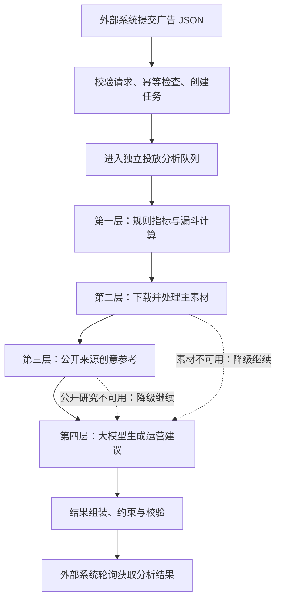

# 外部系统 Facebook 投放数据分析处理流程说明

> **版本：** v1.0
> **适用对象：** 外部投放系统的产品、开发、测试和运营人员
> **配套文档：** [《外部系统 Facebook 投放数据分析接口联调手册》](./外部系统投放数据分析对接说明.md)

## 1. 这份说明解决什么问题

《接口联调手册》说明了**接口地址、请求字段、响应字段和联调方法**；本说明则解释外部系统提交一份广告 JSON 后，AI 系统会怎样处理它、每一层分析依据什么，以及结果的可靠性边界。

一句话概括：

> 系统先用确定性规则计算 Facebook 投放事实，再自行处理主素材、补充公开来源的创意参考，最后由大模型把这些证据转成运营人员可直接阅读和执行的建议；外部系统只需要按 `analysis_id` 轮询查询结果。

本接口的目标不是替代外部系统创建、修改或发布 Facebook 广告，而是为运营人员提供**基于已提交投放数据的诊断和优化建议**。

---

## 2. 总体处理流程



外部系统的交互非常简单：

1. 调用 `POST /api/v1/integrations/ad-performance/analysis-jobs`，提交一份广告数据 JSON；
2. 保存响应中的 `analysis_id`；
3. 调用 `GET /api/v1/integrations/ad-performance/analysis-jobs/{analysis_id}` 轮询状态；
4. 当 `status` 为 `succeeded` 时，读取 `result`，将其中的结论和建议展示给运营人员。

系统**不会主动回调**外部系统。

---

## 3. 提交后：校验、幂等与排队

### 3.1 请求校验

系统会先检查 JSON 的基本结构、必填字段、数值格式和素材 URL 格式。例如：

- `campaign`、`adset`、`creative`、`insight` 等必要对象是否存在；
- 消耗、曝光、点击、转化次数等是否为可识别的数值；
- 图片、视频或轮播素材 URL 是否为完整的 `http://` 或 `https://` 地址；
- 视频素材是否符合可处理范围（建议不超过 20 秒、100MB，接受 MP4/MOV/WebM，优先 MP4 H.264）。

素材 URL 不要求属于特定域名。只要 AI 系统服务器可以通过网络下载即可；同时，系统会拒绝本机地址、回环地址、内网地址及非 HTTP(S) 地址，以避免把内部网络资源暴露给下载流程。

### 3.2 `external_request_id` 的幂等规则

外部系统为每一次提交生成一个唯一的 `external_request_id`，它是创建任务的幂等键：

- **同一个 `external_request_id` + 完全相同的业务数据**：系统返回原来的任务，不重复创建、不重复消耗分析资源；
- **同一个 `external_request_id` + 不同的业务数据**：系统返回冲突错误。外部系统应生成新的 `external_request_id` 后重新提交；
- **新的 `external_request_id`**：系统创建新的 `analysis_id`，并进入异步分析队列。

`external_request_id` 由外部系统生成；`analysis_id` 由 AI 系统生成，专门用于后续查询。

### 3.3 为什么是异步处理

完整分析可能包含素材下载、视频抽帧、公开来源查询和模型调用，不适合让一次 HTTP 请求一直等待。因此 POST 接口只负责创建任务并快速返回，真正的处理在后台完成。

创建成功时，初始状态为：

```text
status = queued
stage = queued
progress = 0
```

投放数据分析使用独立队列，与图片生成、视频生成任务在队列层面隔离，避免分析任务直接占用图片或视频生成的工作槽位。实际耗时仍会受到排队量、素材下载速度、视频处理、公开查询和模型调用速度的影响，因此不承诺固定完成时间。

---

## 4. 第一层：规则指标与漏斗计算

这是整个分析的事实基础。系统会从外部提交的 `insight`、`actions`、视频播放数据及广告配置中，统一整理和计算可验证的 Facebook 指标。

### 4.1 系统会处理哪些数据

系统会读取或计算以下类别的信息：

| 类别 | 示例 | 处理方式 |
| --- | --- | --- |
| 基础投放指标 | 消耗、曝光、覆盖、频次、点击 | 读取外部提交的 Facebook 成效快照 |
| 成本与效率指标 | CTR、CPC、CPM | 使用提交值并结合其他数据判断可用性 |
| 转化事件 | 落地页浏览、购买、注册、首充、加购、线索 | 从 `actions` 中识别对应事件类型和次数 |
| 事件单次成本 | CPA、每次购买成本、每次注册成本等 | 按 `spend / actions[].value` 自动计算 |
| 视频漏斗 | 播放、25%/50%/75%/95%/100% 播放 | 从视频播放事件计算播放和留存情况 |
| 配置一致性 | 广告系列目标、广告组优化目标、预算与出价设置 | 检查当前配置是否存在需要关注的组合 |
| 同组对比 | `siblings` 中的同组广告 | 在外部提供时，用于横向参考，不要求提供 |

金额统一按 **USD** 解读。系统以已提交的消耗和事件次数为依据，并自行计算每类事件成本。

### 4.2 规则层的职责

规则层负责三件事：

1. **计算事实**：例如消耗、点击、事件次数、每次事件成本、视频留存率等；
2. **识别漏斗与数据缺口**：例如有点击但缺少落地页浏览、缺少关键转化事件、视频播放后段留存不足等；
3. **给出可解释的初步诊断**：识别当前更值得优先检查的方向，如素材/文案、落地页、转化追踪、预算节奏或广告设置。

规则层是结果的“事实底座”。大模型只能基于这些事实做表达和建议，不能把未提交的数据当作事实，也不能推翻系统已经计算出的数值。

### 4.3 数据不足时如何处理

部分字段是可选的。例如外部系统暂时不能提供 `inline_link_clicks` 或 `inline_link_click_ctr` 时，系统仍可以使用消耗、曝光、点击、事件等数据完成整体分析；但依赖链接点击数的更细漏斗判断会降级，并在 `data_gaps` 中明确提示。

同样地，当前接口不要求提交国家、年龄、性别、设备或版位维度的拆分成效。因此系统不会声称“某国家表现更差”或“某年龄段成本更低”。如需要对定向做建议，结果会以**小预算、单变量测试**的方式表达，而不是把推测包装成已验证结论。

---

## 5. 第二层：主素材下载与画面处理

系统会根据广告创意类型自行获取和处理主素材：

| 创意类型 | 外部系统提供 | 系统处理方式 |
| --- | --- | --- |
| 图片 | `image_url` | 单次下载最长 30 秒；发生短暂网络错误时自动重试 1 次；下载、校验图片并生成分析用缩略图 |
| 视频 | `video_url` | 单次下载最长 80 秒；发生短暂网络错误时自动重试 1 次；下载、校验视频信息并抽取开场、动态中间和结尾画面 |
| 轮播 | `image_urls` | 每张图片按图片规则下载、校验并生成缩略图 |

### 5.1 视频如何处理

对于视频素材，系统会：

1. 下载视频文件。单次最长等待 80 秒；仅在连接、读取超时、TLS/传输短暂异常或 HTTP 408、429、5xx 时自动重试 1 次，两次之间等待约 1 秒。链接不合法、权限拒绝、文件超限等确定性错误不会重试；
2. 校验格式、文件大小和时长；
3. 读取视频基本信息；
4. **必须尝试抽取开场帧和结尾帧**，再从中段候选画面中按实际画面差异保留 0～3 张，避免固定时间点抽到重复画面；
5. 按“开场帧 → 中间帧（如有）→ 结尾帧”的顺序将画面提供给后续分析环节；
6. 将素材处理摘要提供给后续分析环节。

这样，外部系统只维护原始视频 URL，无需额外维护 `thumbnail_url` 或 `video_keyframes`。对于通常约 12 秒、最长不超过 20 秒的视频，这种服务器侧抽帧适合异步分析场景。若开场帧或结尾帧任一未能成功生成，任务仍会完成数据与文案分析，但会明确标记“视频画面处理不完整”，不会将局部画面当作完整视频结论。

### 5.2 素材处理失败不会阻断整份分析

若素材下载失败、链接失效、文件格式不正确、视频无法解码或抽帧工具不可用，系统不会伪造画面结论，也不会因此直接放弃整份数据分析。任务会继续依据投放数据和文案生成建议，并在结果中说明素材处理未完成或仅部分完成。

处理后的临时素材仅用于本次内部分析，完成后会清理；对外结果不会暴露服务器本地路径。

---

## 6. 第三层：公开来源创意参考

在完成广告自身数据与素材处理后，系统会自动识别研究方向，并从公开网络来源中补充相似广告的创意参考。

### 6.1 研究方向如何产生

外部系统不需要传关键词、竞品名称或研究参数。系统会结合已提交的：

- 广告系列名称和目标；
- 广告组优化目标和投放地区；
- 创意标题、主文案、素材类型；
- 可识别的产品、品牌或素材域名线索；

自动构造公开研究方向。

### 6.2 公开研究能提供什么

公开来源仅用于补充创意层面的参考，例如：

- 常见的开场 Hook；
- 卖点表达方式；
- CTA（行动号召）表达；
- 图片、视频或轮播的素材结构；
- 可用于测试的内容角度。

### 6.3 公开研究明确不能证明什么

公开网页、搜索摘要或公开广告展示通常没有可核验的真实投放成效。因此系统不会将其当作其他广告主的真实效果证据，绝不会据此声称：

- 其他广告的 CTR 更高；
- 其他广告的 CPC 或 CPA 更低；
- 其他广告带来了更多购买、收入或 ROAS；
- 某竞品的投放表现已经被验证更好。

真实效果判断只依据外部系统提交的 Facebook 投放成效数据。公开研究不可用、超时或未找到有效参考时，主分析仍会继续，并在结果中标记对应信息不可用或有限。

---

## 7. 第四层：大模型将事实转为运营建议

大模型不是单独“猜测”广告问题，而是基于以下输入生成运营人员可读的内容：

```text
广告系列、广告组与创意配置
        +
Facebook 投放成效与规则计算结果
        +
主素材处理摘要（如可用）
        +
公开来源创意参考（如可用）
```

大模型主要承担以下工作：

1. 将复杂指标、漏斗和数据缺口翻译为容易理解的结论；
2. 聚焦指出当前最需要优先处理的问题；
3. 生成可执行的文案、素材、预算、投放节奏或定向测试建议；
4. 在有公开来源参考时，提炼可借鉴的创意结构，而不虚构对方的投放成效。

如果模型调用暂时不可用，系统会退回到确定性指标和规则诊断生成结果，并如实标记模型贡献不可用；不会因为模型服务短暂不可用而把已经计算出的投放事实丢弃。

---

## 8. 结果如何生成，以及运营人员应该先看什么

在输出给外部系统前，系统会再次组装和校验结果，使其符合 `facebook_ad_analysis_v1` 结构，并确保建议不会超出已有数据的证据边界。

运营人员建议按以下顺序阅读 `result`：

1. **`summary`**：100 字以内的总体结论；
2. **`overall_decision`**：当前建议是扩量、优化、观察还是暂停，以及最主要问题；
3. **`adjustment_plans`**：按优先级列出的具体操作、原因和预期效果，是最需要先执行的内容；
4. **`copywriting_analysis` / `media_analysis`**：文案和素材层面的可执行建议；
5. **`targeting_analysis`**：当前定向设置及建议测试方向；
6. **`market_intelligence`**：公开来源提供的创意参考和适用边界；
7. **`data_gaps`**：本次结论因缺少哪些数据而存在边界。

结果的核心原则是：**优先展示建议，不把运营人员淹没在原始指标中；同时保留数据不足说明，避免过度结论。**

---

## 9. 可降级场景与整体失败场景

### 9.1 可降级：任务仍会得到结果

以下情况不会自动让整个任务失败：

| 场景 | 系统处理方式 |
| --- | --- |
| 图片、视频或轮播素材无法下载或处理 | 继续基于投放数据和文案分析；结果说明素材不可用或部分可用 |
| 视频抽帧失败 | 不生成画面结论；继续输出数据和文案层建议 |
| 公开来源查询超时、不可用或没有结果 | 继续完成主分析；公开研究状态标记为不可用或无有效参考 |
| 大模型服务暂时不可用 | 保留规则计算和确定性诊断，生成降级结果并标记模型贡献不可用 |
| 可选指标未提供 | 基于现有数据分析，同时在 `data_gaps` 说明无法判断的部分 |

### 9.2 整体失败：需要根据错误信息处理

如果任务执行遇到无法恢复的严重异常，查询结果会显示：

```text
status = failed
stage = failed
```

并在 `error` 中返回错误码、错误说明和是否可重试。外部系统应保存这些信息，针对网络、临时服务等可重试问题按接口手册的重试规则处理；如果是参数或幂等冲突问题，应修正请求后使用新的 `external_request_id` 再提交。

---

## 10. 任务状态、阶段与轮询建议

外部系统可通过 GET 响应中的 `status`、`stage` 和 `progress` 展示任务进度：

| `status` | `stage` | 含义 |
| --- | --- | --- |
| `queued` | `queued` | 已创建，等待后台任务开始 |
| `processing` | `rules` | 正在计算指标、漏斗和数据质量 |
| `processing` | `media_processing` | 正在下载并处理主素材 |
| `processing` | `public_research` | 正在获取公开来源创意参考 |
| `processing` | `llm_analysis` | 正在生成运营可读的分析建议 |
| `succeeded` | `completed` | 分析完成，可读取 `result` |
| `failed` | `failed` | 任务失败，读取 `error` 处理 |

建议外部系统在任务未结束时采用适度轮询，例如每隔数秒查询一次；不要用高频循环请求。具体轮询、重试和错误处理示例请以《接口联调手册》为准。

---

## 11. 外部系统需要配合什么

为了让分析更可靠，外部系统应做到：

1. 为每次提交生成并长期保存唯一的 `external_request_id`；
2. 保存 AI 系统返回的 `analysis_id`，并使用它查询任务；
3. 尽量传递完整的广告系列、广告组、创意和 `insight` 成效快照；
4. 对图片、视频、轮播提供 AI 系统服务器可下载的素材 URL；
5. 尽量传递 `actions` 中的关键转化事件次数（如购买、注册、首充、加购、线索）；
6. 如有同组广告，按可选的 `siblings` 字段提供，以提升横向对比价值；
7. 将 `succeeded` 的 `result` 以“总体结论 + 优先调整计划”为主展示给运营人员，并保留 `data_gaps` 作为结论边界提示。

外部系统提供广告配置、主素材 URL 和投放成效快照；系统负责事件成本计算、素材缩略图与关键帧处理，以及公开来源创意研究方向识别。

---

## 12. 分析结论的使用原则

本接口提供的是运营决策辅助：它会基于已提交的 Facebook 成效、广告配置、素材信息和公开创意参考给出优先建议，但不直接替外部系统修改或关闭广告。

对于预算调整、暂停广告、修改定向或替换创意等动作，建议仍由运营人员结合账户历史、库存、利润、归因口径、业务活动和平台实时状态做最终确认后执行。
